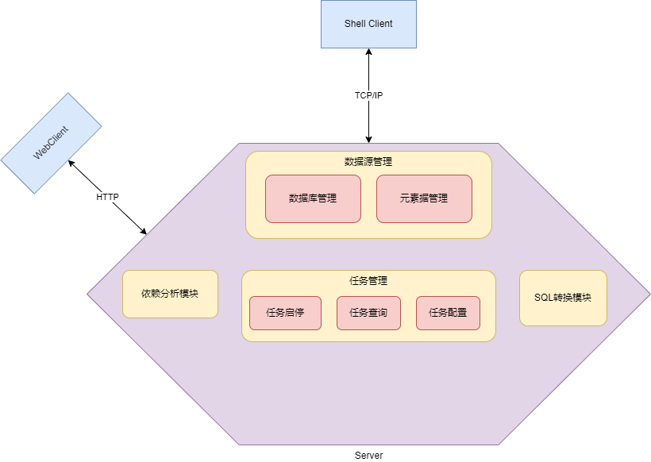
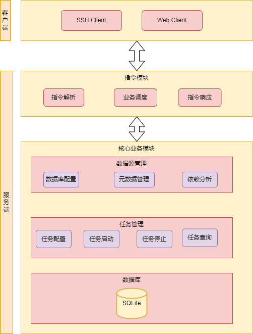

# 架构方案

工具由Server与Client两部分组成，Server提供多种方式与外部通信，Client可以通过Http、TCP Socket等多种方式对Server进行指令操控。

# Server架构

服务端提供核心业务逻辑，所有的数据源管理、任务管理以及SQL解析等业务都需要服务端完成。

## 模块设计

 

## 技术选型

|    技术     | 版本 |                说明                 |
| :---------: | :--: | :---------------------------------: |
|    Java     | 1.8  |             主开发语言              |
| Spring Boot |      |             主开发框架              |
|   SQLite    |      |            嵌入式数据库             |
|    Druid    |      | 提供连接池以及SQL解析、转换功能支撑 |

# Client

Client提供Server操控能力，以指令的方式与Server进行交互。